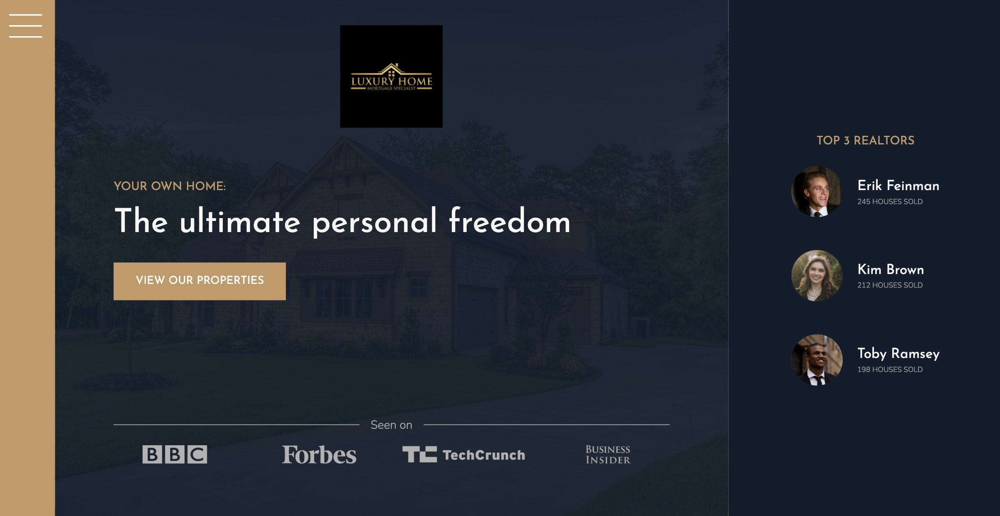
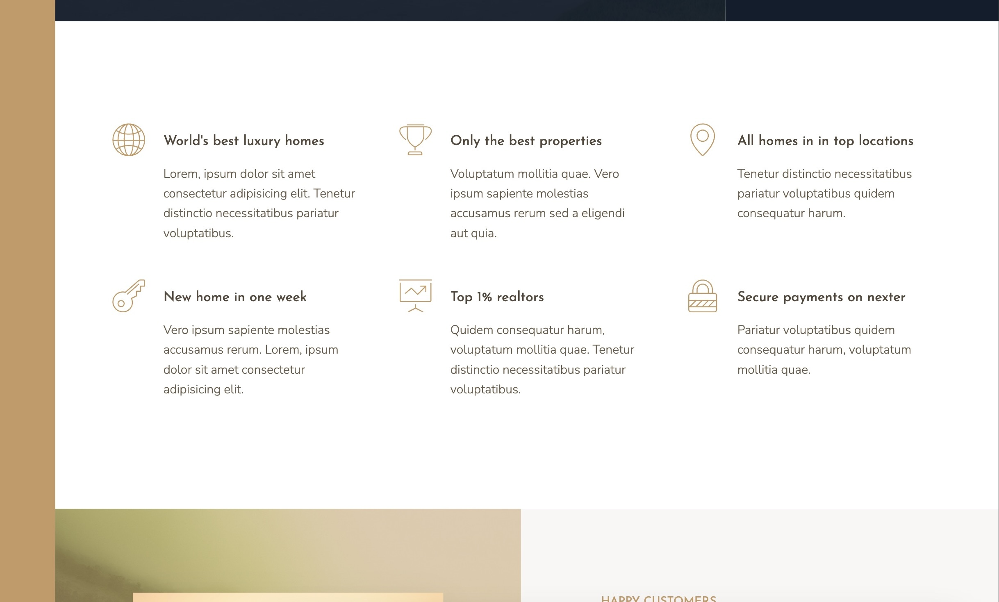
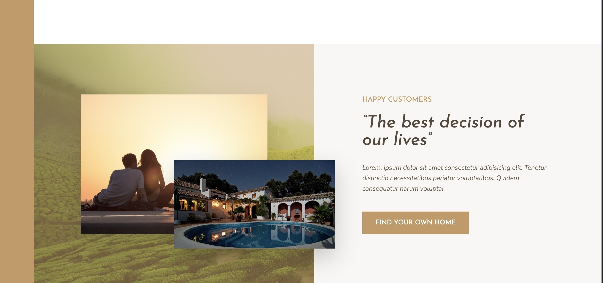
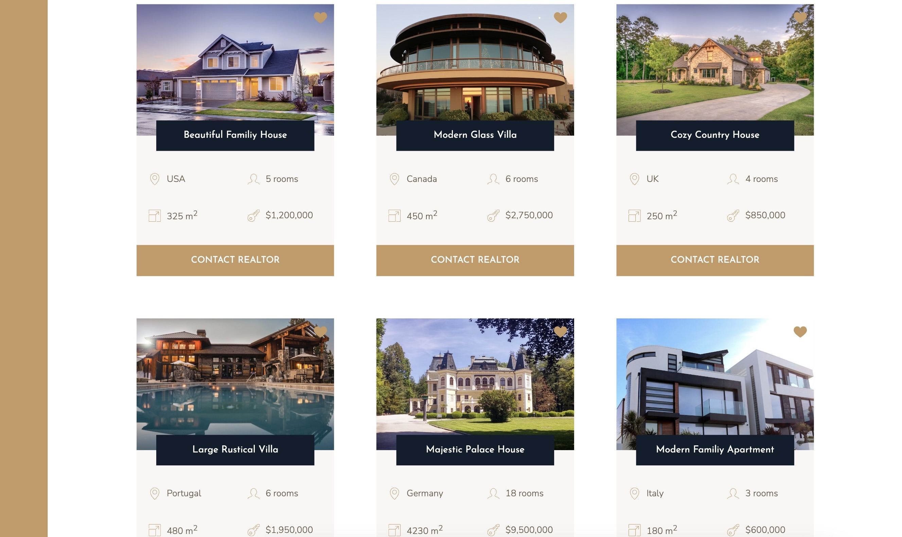
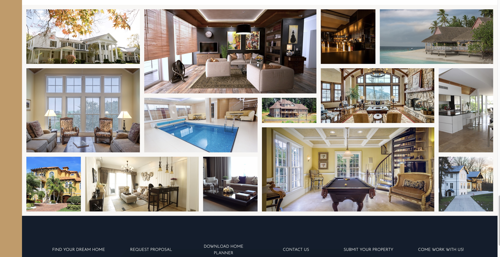

# Luxury-Home

HTML &amp; SCSS &amp; GRID

# Luxury Home Page

This is a simple luxury home page project showcasing the use of HTML, CSS, SCSS, and CSS Grid for responsive web design.

## Features

-   Minimalistic luxury-themed design
-   Responsive layout using CSS Grid
-   SCSS for efficient styling
-   Easily customizable

## Technologies Used

-   HTML5
-   CSS3
-   SCSS
-   CSS Grid

## Getting Started

1. Clone the repository:

```bash
git clone https://github.com/your_username/simple-luxury-home-page.git

```

npm install, npm run start










